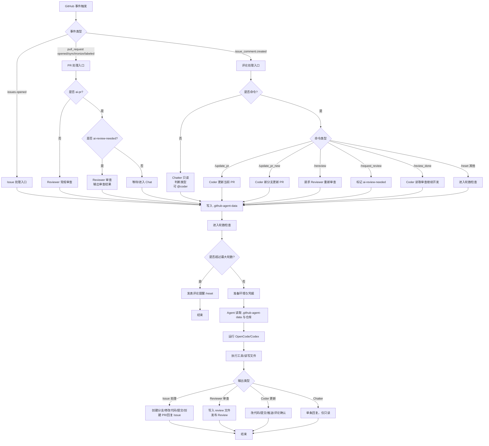

# 架构设计

## 设计哲学

### 无状态架构

每次 GitHub 事件触发时，Action Runner 都是一个全新的沙盒环境：

- 无需维护数据库
- 无需持久化会话
- 无需担心状态一致性

### 最小化胶水代码

我们的 TypeScript 引导程序只做三件事：

1. **配置环境** - 设置 Git 认证和用户身份
2. **构建 Prompt** - 根据事件类型生成任务描述
3. **释放 Agent** - 调用 opencode/codex 并让它接管一切

之后的所有决策都由 Agent 自主完成。

## 完整流程图



## 技术栈

| 层级     | 技术                           | 用途                       |
| :------- | :----------------------------- | :------------------------- |
| 运行环境 | GitHub Actions (Ubuntu Latest) | 提供沙盒执行环境           |
| 胶水层   | Node.js / TypeScript           | 极薄的引导程序             |
| 核心智能 | opencode/codex CLI             | CoT 推理和工具调用         |
| 操作工具 | git + gh-cli                   | 执行实际的 Git/GitHub 操作 |

## 安全模型

### 权限分层

```yaml
permissions:
  contents: write # 允许 git push
  pull-requests: write # 允许 gh pr create/comment
  issues: write # 允许回复 issue
```

### 安全边界

| 保护层          | 机制                                        | 作用                       |
| :-------------- | :------------------------------------------ | :------------------------- |
| **分支保护**    | Branch Protection Rules                     | 阻止直接推送到 main/master |
| **Actor 过滤**  | `if: github.actor != 'github-actions[bot]'` | 防止无限递归               |
| **Token Scope** | 最小权限原则                                | Review 模式只给读权限      |
| **代码审查**    | 人工 Review PR                              | 最终决策权在人             |

### 循环轮数控制

Agent 的行为会触发新的 GitHub 事件，形成自动反馈循环：

```
Agent 提 PR → 触发 PR Review → Agent Review 自己 → 发现问题 → 自动修复 → ...
```

这种循环在某些场景下是**有价值的**（如自动修复 lint 错误），但需要限制轮数防止失控。

**解决方案**：轮数计数 + 最大轮数限制

```yaml
jobs:
  agent:
    runs-on: ubuntu-latest
    steps:
      - name: Check Loop Round
        id: check-round
        env:
          GH_TOKEN: ${{ secrets.GITHUB_TOKEN }}
        run: |
          MAX_ROUNDS=3

          # 从 Issue/PR 评论中读取当前轮数
          ISSUE_NUMBER=${{ github.event.issue.number || github.event.pull_request.number }}

          if [ -n "$ISSUE_NUMBER" ]; then
            # 查找最后一个轮数标记
            CURRENT_ROUND=$(gh api repos/${{ github.repository }}/issues/${ISSUE_NUMBER}/comments \
              --jq '[.[] | select(.body | contains("<!-- agent-round:")) | .body | capture("<!-- agent-round:(?<n>[0-9]+) -->") | .n | tonumber] | max // 0')
          else
            CURRENT_ROUND=0
          fi

          NEXT_ROUND=$((CURRENT_ROUND + 1))

          if [ $NEXT_ROUND -gt $MAX_ROUNDS ]; then
            echo "⚠️ 已达到最大循环轮数 ($MAX_ROUNDS)，停止自动处理"
            echo "should_run=false" >> $GITHUB_OUTPUT
            echo "round=$CURRENT_ROUND" >> $GITHUB_OUTPUT
          else
            echo "✅ 当前第 $NEXT_ROUND 轮 (最大 $MAX_ROUNDS)"
            echo "should_run=true" >> $GITHUB_OUTPUT
            echo "round=$NEXT_ROUND" >> $GITHUB_OUTPUT
          fi

      - name: Run Agent
        if: steps.check-round.outputs.should_run == 'true'
        # ... Agent 执行逻辑
```

**轮数标记**：Agent 在每次评论时嵌入隐藏的轮数标记：

```markdown
我已修复了问题...

<!-- agent-round:2 -->
```

**手动重置**：用户可以使用 `/reset` 命令清除轮数计数，重新开始循环。
